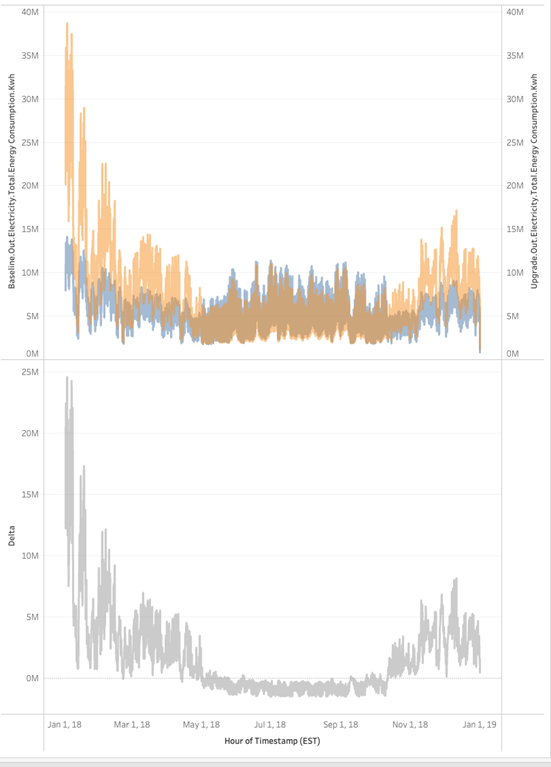
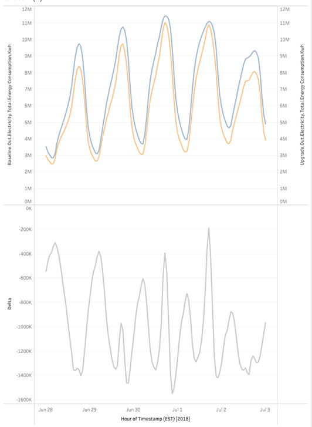
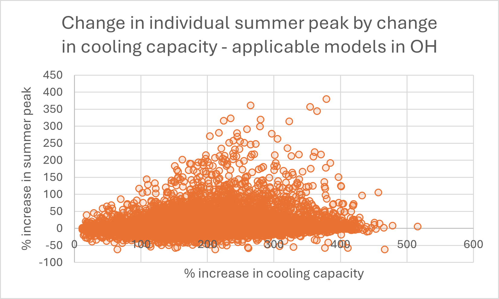
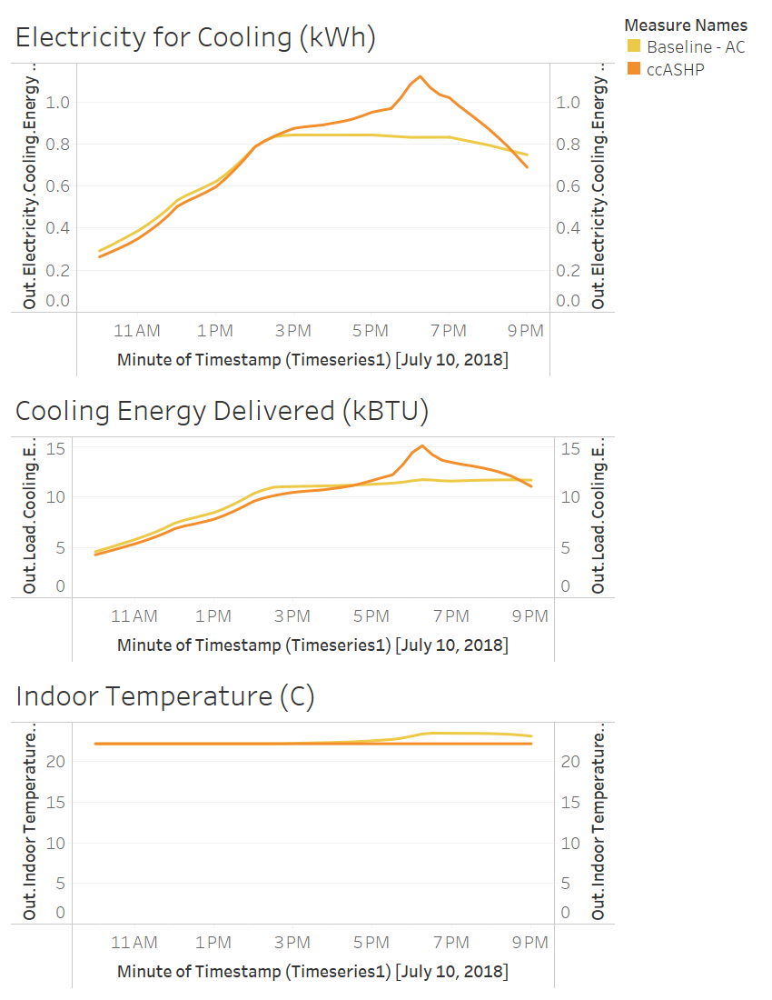
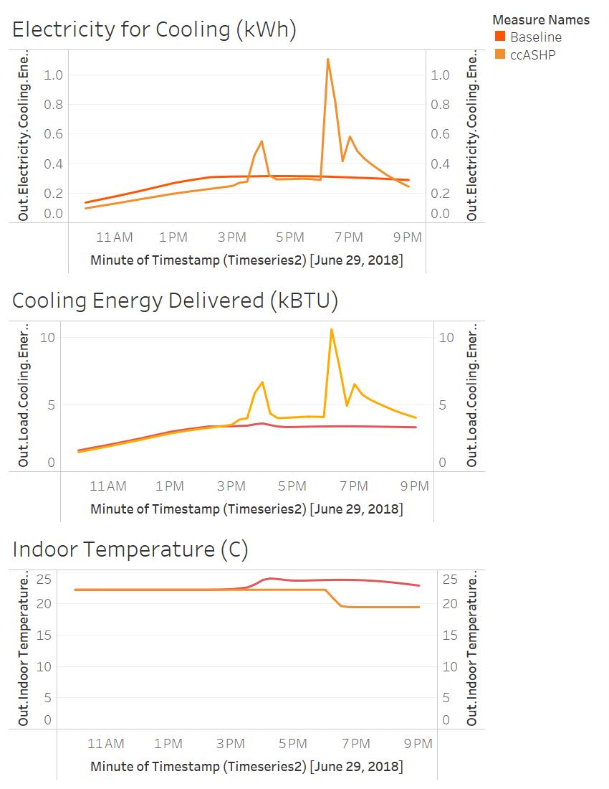

## Summer Peak Increase from Cold CLimate Heat Pump in ResStock 2025 Release 1

"Summer peak savings" came into question when looking closely at the ResStock 2025 Release 1 results for upgrade 4, the cold climate air source heat pump (ccASHP) upgrade. To start, there are two different definitions of "summer peak savings"
1. *Sector peak* - this is the peak electricity demand over a timestep for the residential sector in a particular geographical region (e.g., state, county, national, etc.). It is the sum of the timeseries energy consumption for all building models in the sector on a timestep-basis.
2. *Individual model peak* - this is the peak electricity demand over a timestep for a specific building model in the ResStock dataset.
Here are some of the ResStock team's notes about summer peak savings:
- Peak savings is the difference between the baseline peak of the specific season and the upgrade’s peak of the specific season.
- The baseline and upgrade scenario peaks **do not necessarily** occur on the same calendar day, hour, and timestep.
    - For example, for building ID 158 located in Ohio in the AMY2018 dataset, the summer peak for the Baseline scenario occurs on 7/26/2018 at 6:45pm. For the ccASHP scenario, the summer peak occurs on 6/29/2018 at 4:00pm.
- In the timeseries data, the timestep is 15 mins, so the consumption in kWh for that timestep is multiplied by 4 to get the power in kW. This kW value is what gets reported in the metadata_and_annual_results files.
- Summer peak values consider the months June, July, August. Winter peak values consider the months December, January, and February.

### Aggregated residential summer peak shows positive savings during the summer
Although some individual models show an increase in summer peaks between the ccASHP and the baseline scenario, in aggregate there are savings between the two upgrades as shown in the next image. This is the energy consumption in 2018 in Ohio for applicable dwelling units. Blue is the baseline and orange is the ccASHP upgrade. The bottom half of the graph shows the differences between the two timeseries.

During the summer months, the ccASHP has a negative delta in consumption between itself and baseline scenario. While in the winter, its consumption is expectedly higher as many dwellings in Ohio have a non-electric heating system in baseline. The next figure shows a few of the peak days from a summer in Ohio. Blue is the baseline and orange is the ccASHP upgrade. The bottom half of the graph shows the differences between the two timeseries.

During the peak days of summer in Ohio, the ccASHP upgrade has a lower peak than baseline on the aggregate level. However, there are many individual dwellings that have higher peaks in the summer with the ccASHP upgrade than their baseline data.

While the ccASHP upgrade results in a lower sector summer peak, some individual models show an increase in individual summer peaks between the ccASHP and the baseline scenario. Based on our investigation, the primary reason this occurs is because the ccASHP upgrade results in much larger cooling system capacities (and thus larger power draws) compared with the baseline scenario. The ccASHPs are sized to the maximum of the heating and cooling loads. In many cases, this can result in more cooling capacity than baseline AC systems. Therefore, they can maintain setpoint better than the existing AC systems.

In ResStock, HVAC systems that are not heat pumps have the heating and cooling components each independently sized to the respective heating or cooling load according to design conditions. Heat pumps are one physical piece of equipment that perform both heating and cooling. They can either be sized using ACCA Manual S or to the maximum load of the heating and cooling loads. The ccASHP upgrade is sized to the maximum of the heating and cooling load according to the HVAC design conditions of the geographic location it is located. In cold climates, the heating load often drives the heat pump capacity so many ccASHPs in the dataset end up with a much larger cooling capacity than the baseline AC system.

Models that the ccASHP applied to and are 100% conditioned in the baseline sample **have an average increase in delivered cooling energy of ~2200 kBtu/yr (5%)** compared to baseline and **an average increase in the rated cooling capacity of ~2.5 tons (85%)**. These numbers are very similar when reducing the sample to only models with a negative summer peak. The next image shows how the percent increase in summer peak correlates to a percent increase in the cooling capacity for each applicable dwelling unit in Ohio.

The increase in cooling capacity of the ccASHP compared to the baseline system increases the summer peak value in a majority of the models. However, because of diversity in the timing of individual dwelling unit peaks (including thermostat offset behavior), this does not result in an increase in aggregate sector peak demand. Sometimes the peak increase percentage is over 100%, although 97% of the models have peak increases lower than 100% and 93% of models have peak increases lower than 50%.

### Example dwelling units that show an increase in summer peak

Below are two analyses of individual dwelling models that show what is happening on their respective summer peak days.

The next charts are for Building ID 266927 in Colorado for a day that shows increased summer peak after the ccASHP upgrade. The figure shows the 15 minutely results for cooling electricity use, cooling energy delivered, and indoor temperature. The baseline AC is sized at 49,909 BTU/h rated cooling capacity and the ccASHP is sized at 213,113 BTU/h rated cooling capacity. It delivers 2511 less kBTU of cooling energy over the year.

Starting at 2pm and continuing through 9pm, the baseline AC is  running full speed and delivering  the maximum cooling it is able to deliver. At around 6pm, the indoor temperature begins to stray away from the setpoint of ~22 degrees Celsius because the capacity of the cooling system in insufficient to meet the load. For the ccASHP, there is a spike in its electricity consumed for cooling at this same time and a spike in its cooling delivered. Because the ccASHP is sized larger than the baseline AC, it able to deliver the cooling required to maintain setpoint. One can see that the ccASHP maintains the setpoint throughout the day. The higher electricity use for the ccASHP is a direct result of it being able to deliver more cooling to maintain setpoint, thus increasing the summer peak for this dwelling.

The next charts are for Building ID 158 in Ohio for a day that shows an increased summer peak after the ccASHP upgrade. It shows the 15 minutely results for electricity for cooling, cooling delivered, and indoor temperature. The baseline AC is sized at 17,138 BTU/h and the ccASHP is sized at 57,349 BTU/h. It delivers 737 more kBTU of cooling over the year.

The results for this dwelling are similar to the building in Colorado, but with the added consideration of a setback in the setpoint which ends around 6pm. Again, one can see the cooling delivered for the baseline AC capped around 3.5-4 kBTU while the ccASHP can deliver more than double that amount when it is necessary to maintain the setpoint and to handle the increased load from when the thermostat setpoint decreases a few degrees Celsius around 6pm. The increase in cooling delivered coincides with the peak in electricity for cooling for the ccASHP, thus increasing the summer peak for this individual dwelling.

### Conclusion
We assume system sizing is “perfect”, but many real central AC systems are oversized to some degree. This would lead to a lower magnitude of increases in summer peaks for individual models. Additionally, the size of some ccASHPs (following the “Max Load” sizing methodology) are unlikely to be implemented in reality.